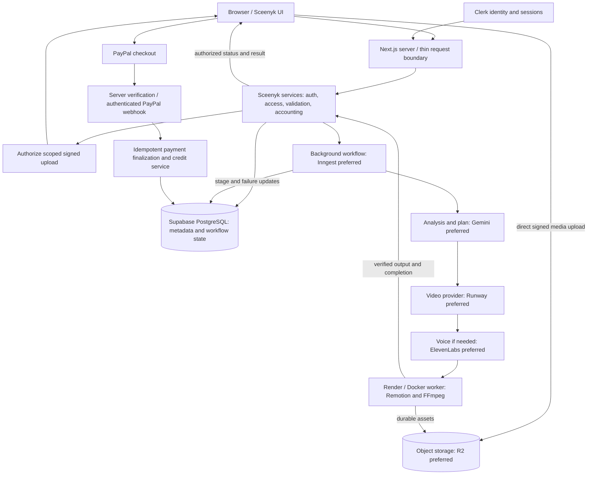

# Architecture Context

Technical boundaries for Sceenyk's prompt/media-to-finished-video platform. Read with [overview.md](overview.md), [ui-context.md](ui-context.md), [design-system.md](design-system.md), [ai-workflow-rules.md](ai-workflow-rules.md), [code-standards.md](code-standards.md), and [progress-tracker.md](progress-tracker.md).

**Repository inspection: 2026-10-10.** **Confirmed** means present in current source/dependencies; live verification is explicitly identified below and in the tracker. **Planned** means specified architecture or the preferred direction supplied for this document, with no integration yet. **Undecided** identifies details still requiring a decision. All service/data-flow diagrams and contracts below are planned unless explicitly identified as implemented.

The public UI foundation includes a server-composed landing page and shared navigation/footer. Clerk development authentication and minimal hosted application identity are verified. Owned projects and `project_assets` exist in hosted Supabase; broader project acceptance is tracked separately. The authorized media unit now verifies real browser direct uploads to Cloudflare R2, storage-verified finalization, private previews, refresh/reopen and two-account ownership in development. Showcase artwork is illustrative. The persistent generation-job foundation is implemented in source; hosted migration/acceptance is pending. No processing, credits, payments or workers exist.

**Public UI contract (2026-10-09):** use existing CSS tokens and shadcn/Base UI controls. Theme initialization runs before paint; saved `sceenyk-theme` overrides system preference, otherwise follow the system. Preserve root font classes, keep the landing page static, and tolerate unavailable browser storage. Public navigation uses working section anchors. Paid pricing remains unpriced preview copy until product rates are approved.

**Creation workspace (updated 2026-10-09):** public `/create` retains category, prompt, local Files/previews and four creative settings. Explicit Save draft stores only the validated brief. Permanent Upload to project first successfully saves an unsaved project through the same stable UUID/in-flight promise, then retains Files while changing to `/projects/[id]`. Browser XHR sends files directly to private R2 with real progress; server finalization verifies stored content before the UI shows uploaded media. Reopen restores owned asset metadata and authorized active previews. Selected local Files remain outside brief payloads/schema and temporary object URLs are cleaned up. Permanent deletion is deferred. Generate now queues a validated immutable request for a saved owned project. Jobs remain queued without a processor, and no accounting occurs; options remain creative-brief choices.

**Development payment invariant:** all future payment development/testing uses PayPal Sandbox only, with no real-money transactions or Live credentials. Future payment configuration must separate environment/credentials behind the payment service so production can deliberately switch to Live later. This UI unit adds no payment code or credentials.

**Dashboard/authentication contract (updated 2026-10-09):** `/dashboard` and `/projects/[id]` require verified Clerk sessions and fail closed when configuration is missing. One root Clerk provider/theme and existing shells remain. `/` and `/create` are public. Signed-out private routes/actions redirect to the fixed `/?auth=sign-in` modal entry; authentication completes at `/dashboard`. Browser return URLs/owner claims never authorize access. Every project service independently uses `ensureAppUser` without a supplied owner. Dashboard queries only owned project summaries/counts, ordered by updated time and ID descending, eight per page. Project read/update queries include both ID and owner. Genuine database failure is distinct from empty/not found. Latest job status appears on project cards; credits and templates remain previews. Private workspace state is keyed by account/project, and hidden until the active Clerk identity matches its server-resolved viewer. No private shared cache is introduced.

## Stack

| Layer | Technology | Role |
| --- | --- | --- |
| Application — Confirmed foundation | Next.js 16.4.0 App Router, React/React DOM 19.3.0 | Static public `/` and `/create`; protected request-time dashboard and `/projects/[id]`; thin authenticated project/media Server Actions. Hosted project-first save/reopen verified; broader project acceptance remains separate. |
| Language/tooling — Confirmed | TypeScript 5.9.3, ESLint 9.39.5, npm, Zod 4 | Strict typed code and runtime project validation. `npm run test:generation` runs isolated SQL/service integration checks using development-only PGlite and Node assertions. |
| UI — Confirmed foundation | Tailwind CSS 4.3.3, `@tailwindcss/turbopack` 4.3.3, shadcn 4.21.3 (`base-nova`), Base UI 1.8.0, Lucide React 1.52.0 | Button/Dialog/Sheet, public and dashboard shells, shared EmptyState, themes, and local creation previews. Upload progress is real; persisted job-state UI is implemented in source, with hosted acceptance pending. Processing/results remain Planned. |
| Typography — Confirmed | Inter and Geist Mono via `next/font/google` | UI/headline and mono fonts; global aliases live in CSS. |
| Authentication — Development verified | Clerk Next.js 7.9.13, Clerk UI 1.39.1 | Development-only provider, centered official modals/account controls, proxy plus server resource protection. No dedicated auth pages. |
| Database — Development persistence verified | Supabase PostgreSQL via `@supabase/supabase-js` 2.117.3 | One server-only SDK layer with hosted identity/projects/assets. Live media ownership/persistence verified; SQL grants/constraints tested in isolated PostgreSQL, not a full hosted catalog audit. No ORM/browser database/Supabase Auth. |
| Object storage — Development verified | Cloudflare R2 via AWS S3 SDK/signing | Real direct signed browser PUT, server HEAD/ranged-signature verification, authorized GET and refresh/reopen verified against `sceenyk`. Generated assets and production deployment remain future work. |
| AI orchestration — Planned boundary | Shared internal Sceenyk AI services; Vercel AI SDK is a preferred option | Common language/multimodal provider boundary. Whether to adopt the SDK is Undecided; it is not installed. |
| Video understanding — Planned preferred | Google Gemini | Analyze prompt/uploaded media, scenes/actions/timestamps, and support production planning. Exact models and contracts are Undecided. |
| Video generation/transformation — Planned preferred | Runway, or the first provider selected for the supported MVP path | Generate/transform scenes behind a replaceable video service. No SDK/provider implementation exists; final provider/model selection remains open. |
| Voice — Planned preferred | ElevenLabs | Narration/voiceovers when required by the chosen creation path; model/voice policy remains Undecided. |
| Video assembly — Planned preferred | Remotion | Programmatic compositions combining scenes, captions, audio, overlays, and animations. Not installed/configured. |
| Video processing — Planned | FFmpeg | Cutting, resizing, transcoding, audio extraction, frame-rate conversion, compression, thumbnails, and final processing. No worker invocation or repository-managed binary exists; host availability was not tested. |
| Background workflow — Planned preferred | Inngest, or the workflow provider adopted for implementation | Durable stage execution, retries, and resumable orchestration. No workflow definitions/SDK exist. |
| Heavy processing — Planned preferred | Render + Docker | Worker environment for FFmpeg, Remotion, and long/CPU-heavy media work outside lightweight web hosting. No Dockerfile/worker deployment configuration exists. |
| Payments — Planned | PayPal | Hackathon credit purchases first; subscriptions, marketplace purchases, and eventual creator payouts are later capabilities. No checkout/webhook/service implementation exists. |
| Deployment — Planned preferred | Vercel for Next.js; Render for media workers | Separate web/request handling from heavy processing. Repository inspection does not confirm active deployments or external accounts. |

Installed versions above were checked with `npm ls --depth=0`; its extraneous platform/WASM packages are not product integrations. `.gitignore` mentioning `.vercel` and the starter page linking Vercel are not evidence of deployment.

**Environment baseline (2026-10-10):** ignored `.env.local` contains working Clerk development and new Supabase development project credentials. The blank committed `.env.example` lists `NEXT_PUBLIC_CLERK_PUBLISHABLE_KEY`, server-only `CLERK_SECRET_KEY`, `SUPABASE_URL`, `SUPABASE_SECRET_KEY`, and the optional legacy `SUPABASE_SERVICE_ROLE_KEY` alternative. Clerk requires `pk_test_`/`sk_test_` and rejects production prefixes. Privileged Supabase and configured `R2_ACCOUNT_ID`, `R2_ACCESS_KEY_ID`, `R2_SECRET_ACCESS_KEY`, `R2_BUCKET_NAME` stay server-only; `MEDIA_MAX_UPLOAD_BYTES` is optional. Missing Clerk configuration denies the dashboard; database/profile failure produces a distinct signed-in workspace error. No secret value is logged or committed. See [authentication.md](authentication.md) and [database.md](database.md).

## System Boundaries

### Existing structure

The repository uses root-level folders, not `src/`. The `@/*` TypeScript alias resolves to `./*`; preserve that structure.

| Existing location | Current responsibility |
| --- | --- |
| `app/` | Root document/theme/CSS; public shell for `/`, `/create` and visually shared private `/projects/[id]`; dashboard shell. `actions/projects.ts` is a thin authenticated mutation boundary; no Route Handlers. |
| `components/ui/` | shadcn/Base UI Button and token-adapted Dialog/Sheet. |
| `components/` | Shared brand/navigation/footer/themes/auth/artwork/EmptyState; landing/creation/dashboard composition, explicit draft save states, project metadata cards and load-failure UI. No database access in presentation. |
| `lib/` | Theme/utilities; `auth/` verifies Clerk and resolves application identity; `db/` owns the sole privileged SDK/config/schema contract; `projects/` owns shared choices/types/validation and authenticated owned persistence. |
| `public/` | Sceenyk preview brand mark and unused stock SVGs. |
| `context/` | Product/UI/design specifications, workflow, coding standards, progress, and this architecture. |
| `designs/` | Two PNG references for the same UI in light and dark modes. |
| Root configuration | npm manifest/lockfile, TypeScript, ESLint, Next.js, shadcn configuration, and agent instructions. |

`app/globals.css` owns semantic theme tokens and Tailwind 4's CSS-first configuration. Light is `:root`; `.dark` on `<html>` switches themed tokens and utilities. Inter/Geist Mono are loaded in the root layout. `ThemeController` synchronizes system/storage events and `ThemeToggle` persists explicit choices. The inline root-head initialization follows the installed Next.js flash-prevention guide; only the root receives `suppressHydrationWarning` for the class change. Landing content remains server-rendered and statically prerendered. Keep one shared visual system and generic shadcn primitives, preserving behavior/accessibility.

### Intended boundaries as features are introduced

These are future locations/contracts, not created folders. Add only what the requested vertical slice needs; document changes rather than scaffolding the entire architecture.

| Boundary | Responsibility and limits |
| --- | --- |
| `app/` | Routes, layouts, thin Route Handlers/Server Actions, loading/error boundaries, and page composition. Reusable business logic belongs in services. |
| `components/ui/` and `components/` | Generic shadcn primitives and shared Sceenyk UI composition. No secrets or server-only accounting/provider logic. |
| `features/<feature>/` | Feature-specific components/hooks/logic when the feature is large enough to justify it. |
| `lib/auth/` | Verified Clerk identity/session helpers and application identity resolution. |
| `lib/db/` | Server-only Supabase SDK/config/types. Authenticated owned project operations live in `lib/projects/`; no second database library. |
| `lib/storage/` | Asset keys/metadata, upload authorization, signed URLs, download/deletion, and storage-provider adapter. |
| `lib/ai/` | Language/multimodal analysis and planning contracts; SDK/provider-specific implementation below this boundary. |
| `lib/video-ai/` | Video-generation/transformation interface and provider implementations, e.g. future `providers/runway.ts`. |
| `lib/voice/` | Voice-generation interface and adapters. |
| `lib/payments/` | PayPal checkout, verification, webhook handling, payment finalization, and later subscription/payment capabilities. |
| `lib/credits/` | Server-authoritative free allowance, costs, reservations, spending/restoration, and ledger operations. |
| `lib/generation/` | Request-to-production orchestration, stage contracts, persistent job state, and coordination of provider/worker services. |
| `lib/validation/` | Shared runtime schemas for untrusted request/provider/webhook/configuration data. |
| `types/` | Genuinely shared domain types, including the adopted job-state contract. |
| Future workflow/worker and migration locations | SQL migrations now live in `supabase/migrations/`; preserve applied files. Workers remain future work separate from web hosting. |

Prefer Server Components; use small client components for interactive state and controls. The installed Next.js configuration enables `cacheComponents` and `partialPrefetching`; read its local guides before implementing request-time/session reads, use appropriate Suspense boundaries, and never share authentication decisions or private data through an unscoped cache. Thin routes/services validate, authenticate, authorize, and delegate; no application framework setting should be disabled to conceal an integration error.

## Storage Model

### Persistent generation-job contract — source implemented 2026-10-10, hosted acceptance pending

This unit adds only the persistent request/state boundary in `lib/generation/`, not dispatch, providers, accounting or outputs. Generate requires a saved owned project and a nonempty validated prompt. It snapshots the current prompt, category and four settings plus all currently uploaded project asset IDs; unfinished local Files must be uploaded or removed first. A snapshot is independent of subsequent draft edits. There is no implicit autosave on Generate.

`generation_jobs` has a server-generated UUID, verified owner/project composite FK, request UUID unique per project, validated versioned JSON input snapshot, status/stage, safe failure code/message and database timestamps. Snapshot, ownership and request identity are immutable. Creation retries reuse the request UUID and identical normalized snapshot; a changed payload conflicts. Multiple jobs per project remain possible. No progress percentage, provider fields, result asset, credit fields or one-job-ever restriction is introduced.

See [generation-jobs.md](generation-jobs.md) for setup, action boundaries and the pending live acceptance checklist. The shared TypeScript contract is `lib/generation/contract.ts`; the SQL migration enforces the same contract, verified by integration checks. States are `queued → processing → completed|failed`, with `queued → failed` also allowed. Stages are preparing, analyzing, planning, generating, voice and rendering; processing may skip optional stages but cannot move backward. Queued and completed have no current stage; failed may retain the stage where it stopped. Terminal jobs are immutable. Failure messages come from a fixed safe code map. Server-only transition functions use owner/project/job filters and compare-and-set against expected status/stage. No status mutation Server Action is exported. Without a worker, real user jobs remain queued; terminal development fixtures do not claim a generated result.

Workspace recovery reads the latest job ordered by creation time and ID descending, limited to one. Reads independently verify Clerk → app user → project → job. Initial server data plus explicit refresh and route activation/pageshow/visibility recovery use uncached owned reads; no timer simulates progress. Dashboard cards use at most one latest-job query for each of the eight visible owned projects, with bounded activation/pageshow/visibility recovery; status failure is distinct from Draft. Job actions return DTOs without owner identity; the owned request UUID supports exact retry recovery. They do not invalidate the active route, preserving local Files. A future worker needs a separately authorized dispatch/authentication and output-finalization contract before using these transitions.

### Owned draft projects — prior unit and historical baseline

The media unit now confirms projects exists in hosted metadata and verifies real project-first save/retry/refresh/reopen. Historical migration/acceptance notes below describe the prior unit. Local media has since gained a separate asset schema/storage boundary described below; it still never enters brief payloads.

Historical at the beginning of the 2026-10-09 project unit: saved creative briefs existed in source and the initial hosted Data API inspection exposed only `app_users` with eight verified columns; the new projects migration is pending user application. `projects` has UUID ID/owner FK, title, category, prompt, current aspect ratio/duration/style/tone choices, draft status and database timestamps. Browser roles have no access; service_role can insert/read and update only editable fields. An owner/update-time/ID index supports newest-first pagination. Duration remains a constrained text value matching the current controls (10/15/30 seconds).

Every exported project service resolves the request through `ensureAppUser`; no operation accepts an owner. Reads and updates filter by both ID and that application identity. Strict Zod validation rejects unknown ownership/status/media fields. A new workspace retains one UUID across save attempts; insert uniqueness plus an owner-scoped update on a duplicate ID makes retries safe without an unrestricted upsert. Existing project saves only update and never recreate a missing or foreign record.

Missing/foreign/invalid project reads return the same explicit unavailable UI inside the streamed boundary; they expose no workspace fields or existence details. This expected result retains the Clerk provider rather than throwing during streamed rendering. Private-route metadata is always noindex; streamed responses use 200. Workspace controls use per-instance React IDs and radio groups to preserve associations across retained routes.

Public `/create` stays available. Save is explicit, authenticated, and confirmed by the server. A saved draft has the private stable URL `/projects/[id]`, reusing the same workspace under the public visual shell with request-time authentication/ownership behind Suspense. No private shared cache is introduced; saves invalidate dashboard/project router data. Only brief fields are restored; local Files, object URLs and paths never enter persistence. There is no autosave, delete, sharing, generation, credit, storage or payment work. Migration application and live acceptance remain pending until recorded in the tracker.

### Supabase PostgreSQL — Minimal identity verified in development

The first database unit adds `lib/db/config.ts`, `server.ts`, and `types.ts` with the official Supabase JavaScript SDK, no second ORM or browser client. `lib/auth/ensure-app-user.ts` has no identity argument: it verifies the request through Clerk, retrieves that account's server profile, and atomically upserts only `clerk_user_id`, verified primary email, nullable first/last names, and image URL. `onConflict: clerk_user_id` preserves the application's UUID and creation time; the database owns update timestamps. It returns the application record to server code. No Clerk password/session/token, browser-supplied ID, or Supabase Auth session is stored or used.

`ensureAppUser` awaits `connection()` before real-request identity work. The dashboard layout and every project service independently resolve identity; auth/framework signals propagate, never becoming application failures. Database fetches remain uncached and bounded. Configuration/profile failures log only constrained codes and render controlled signed-in failures. No cross-request identity cache or client synchronization exists.

`supabase/migrations/20261009000100_app_users.sql` is the **initial migration applied by the user through SQL Editor**, authored for the new development database selected by the user. Repository inspection found no existing database client, schema, or migration convention. The privileged Data API metadata initially exposed no application tables; after user-confirmed application, its eight-column app-user contract and real writes were verified. The migration transaction inspects public table existence and refuses an existing application schema rather than guessing or replacing a user table. It introduces only `app_users` (UUID primary key, unique nonempty Clerk ID, nullable profile fields, timestamps), its timestamp trigger, RLS enabled with no browser policies, and SELECT/INSERT/UPDATE for `service_role`. `anon`, `authenticated`, and PUBLIC have no table grants. The privileged SDK bypasses RLS, so verified Clerk identity at the server remains mandatory. Other domains/tables and webhook synchronization remain planned.

Set server-only `SUPABASE_URL` and `SUPABASE_SECRET_KEY` (preferred `sb_secret_` key) for that development project; legacy `SUPABASE_SERVICE_ROLE_KEY` is an alternative. No `NEXT_PUBLIC_*` database variable is required. Configuration rejects public privileged-key variables, invalid endpoint URLs and public/anon key classes. `.env.example` is blank and actual keys remain ignored. The user confirmed migration application; real hosted unique-key rejection, two-account synchronization, repeated refresh/re-login, profile updates/null restoration and stable UUID/creation time passed. Isolated PostgreSQL verified RLS and grants. A separate hosted catalog/browser-role audit was not performed without a SQL connection or public key; applying the migration and successful service-role writes are the available hosted evidence.

PostgreSQL records application relationships and workflow truth:

- Application user/profile records mapped to Clerk identity; projects and ownership.
- Generations, generation jobs/states, prompts/configuration, stage results, failure context, and provider job references.
- Asset metadata and project/user associations, not large media binaries.
- Credit balances/reservations and ledger/transactions, payments, and eventual subscriptions.
- Later creator templates, listings/purchases, and creator earnings metadata.

These are conceptual data categories, not existing tables/columns or a complete schema. Introduce migrations only for the current unit after defining relationships, constraints, indexes, and access policies. Never rewrite a migration that may have been applied; record application/verification status. Privileged database access must still enforce ownership. The current generation unit reinspected the hosted Data API prerequisite tables/columns before authoring migration 004; future domains remain unspecified.

### Object storage — private R2 project media, current authorized unit

Application → `lib/media/server.ts` (verified Clerk/application identity and project ownership) → `lib/storage/server.ts` → `lib/storage/r2.ts`. R2-specific SDK/signing stays in the provider adapter. `app/actions/media.ts` exposes thin metadata-only Server Actions with Next.js same-origin protections, safe errors and framework signal propagation. Files go from browser to R2 through XHR, never through a Next.js upload body.

The new `20261009000300_project_assets.sql` migration requires `app_users` and `projects`. Metadata includes server-generated asset ID/key, owner/project, stable client upload-request UUID, original filename, canonical MIME, declared byte size, category, pending/uploaded/rejected status and verified ETag. Composite project/owner FK prevents inconsistent ownership; request uniqueness makes retries/concurrent authorization reuse one row. Browser roles are denied; service_role may insert/read and update only status/ETag. Every media operation independently resolves authenticated identity and filters owned project/asset IDs. DTOs omit owner, upload request and storage key.

R2 keys use server-generated UUID path segments under `users/{appUserId}/projects/{projectId}/{assetId}/{randomUUID}`. Filenames stay metadata only. Upload authorization lasts five minutes and binds Content-Type, Content-Length and If-None-Match `*`. Conditional PUT prevents overwrite/replay after any successful object write. Server finalization checks HEAD metadata and reads at most 8192 bytes with an ETag condition, detecting supported file signatures using `file-type`. Successful repeated finalization returns the same asset; missing storage stays pending, mismatched content becomes rejected. Full decoding, malware scanning and media transforms are not implemented.

Private GET links last fifteen minutes, are issued only for owned uploaded assets, and use private/no-store response caching. They are bearer capabilities: an authorized owner can share a link until it expires. Object keys necessarily appear in that owner's signed URL, but never in another user's results. Metadata stores stable keys, never expiring URLs. Reopened workspace queries owned metadata and requests a fresh read link only for the active preview; expired/decode-failed previews offer Refresh preview. Activation/pageshow/visibility restores fresh owned metadata through an uncached Server Action, without time-based polling. Finalization merges its result locally rather than revalidating the active route, preserving remaining local Files after the address changes from `/create`.

An explicit local Upload to project saves a new project successfully first, reusing the existing first-save UUID/promise to avoid duplicate projects. It then updates the address to `/projects/[id]` with supported native history replacement, retaining local Files while refresh gains a stable reopen path. Local selections remain removable; uploaded assets remain attached and permanent deletion/abandoned-object retention are deferred. Pending rows reopen with Check upload for completion recovery. See [media-storage.md](media-storage.md) for configuration, CORS, temporary size safeguard and deployment acceptance.

**Live transport diagnosis (2026-10-10):** the browser received the signed URL and called XHR `send(File)`, but the bucket initially refused OPTIONS because CORS omitted `If-None-Match`. The user added that header without weakening signed conditional writes; actual OPTIONS 204 and PUT 200 then passed. Check upload only verifies an existing object and cannot resend a File lost on reload. Temporary development transfer diagnostics recorded stage/status only and were removed after verification; no signed URLs, headers, bodies or credentials were logged. Public r2.dev/custom-domain access is disabled per the user's settings confirmation; unsigned S3 access is checked separately in live acceptance.

The following broader generated-media direction remains planned:

Store original uploaded video/images/audio, generated images/scenes, transformed clips, narration, thumbnails, intermediate render assets when needed, and final videos separately from PostgreSQL.

Database metadata should describe the stable storage key/reference, MIME type, byte size, duration, width/height where applicable, owner, project, creation time, and processing state. Generate expiring signed URLs when authorized access is needed; do not use an expiring URL as the only durable asset identity.

Prefer authorized direct browser-to-storage uploads for large files. The server determines owner/project association and allowed keys/type/size; completion must be checked before an upload is treated as ready. Downloads and provider/worker media access must be scoped to their task. User filenames or browser-reported metadata are not authoritative storage paths or validation.

Private uploaded-project delivery and explicit formats are now defined by this unit. Private bucket/CORS behavior is development-verified; retention/deletion and final product size rules remain Undecided. Generated public marketplace assets may adopt a separate later policy. An asset is not public merely because its key is known.

### Temporary processing storage — Planned

Workers may download stage inputs into temporary local files for FFmpeg/Remotion processing. This disk is scratch space, never permanent application storage. Clean up after success/failure under the approved lifecycle policy, upload durable outputs to object storage, and persist references needed for retries. A local worker path must never be the user's final result link.

## Auth and Access Model

### Authentication and application identity

Clerk is the specified identity/session source of truth. Visitors can explore the public product without signing in. Starting generations, creating/saving/viewing private projects, buying credits, subscribing, and account-dependent creator/marketplace features require authentication.

Sign-in/sign-up opens through centered Clerk modals/overlays; there are no dedicated `/signin` or `/signup` pages and no second custom password/auth system. The development SDK/provider, official centered modals/account controls, server guard and real session flows are verified. See [authentication.md](authentication.md).

Protected server operations derive the user from verified Clerk sessions. `ensureAppUser` maps that request identity uniquely to `app_users` through the server-only Supabase SDK. Clerk continues to own authentication. Database-safe upsert tolerates repeat/concurrent requests without duplicate profiles; account updates independent of activity via webhooks remain deferred.

### Ownership and authorization

- Each private project has an owner. Generations/jobs belong to a project and/or user with consistent ownership; input/output assets are associated with their user/project.
- Balances, ledger entries, subscriptions, and payments belong to the relevant user. Later marketplace listings belong to their creator; public listing metadata does not make private project/media data public.
- Server/data access checks enforce authentication, resource ownership, permissions, and entitlements where required. Changing a URL/request ID must never reveal another user's private data.
- Access is server-mediated: browser grants are revoked and RLS has no browser policies. The privileged SDK bypasses RLS, so every project operation derives its owner through Clerk/application identity; read/update queries filter owner plus project ID. Hosted project/media persistence and media ownership pass; broader prior project acceptance remains separate. Supabase Auth remains unused.
- Signed media URLs and job-status/result endpoints need ownership enforcement as well as project mutations. Worker/provider callbacks use verified service identities and job association, not browser-supplied ownership claims.

## Generation Architecture

### Planned production pipeline

1. Accept the user's prompt, supported creation type/options, and optional ready media references.
2. Verify Clerk authentication; validate inputs and project ownership/access.
3. Calculate server-authoritative free-generation eligibility or credit entitlement/cost and reserve capacity according to the approved policy.
4. Persist the generation and owned queued job, then dispatch durable background work. Define a recoverable handoff so a dispatch failure does not strand capacity or accepted jobs; do not claim a distributed transaction across PostgreSQL and a workflow provider.
5. Analyze prompt/media through the AI service (Gemini preferred), producing validated scene/action/timestamp context where needed.
6. Create a production plan: required scenes, script/commentary, assets, timing, and supported settings.
7. Generate or transform scenes through the replaceable video service (Runway preferred initial candidate).
8. Generate/refine script/commentary and voiceovers where the plan requires them (ElevenLabs preferred). Script preparation may occur before scene generation when required; stages follow explicit dependencies.
9. Assemble media, captions, audio, and overlays into a composition (Remotion preferred).
10. Render/process in the heavy worker environment using Remotion/FFmpeg as needed.
11. Upload the final output to object storage, verify it is retrievable, and persist its stable reference/metadata.
12. Finalize generation state and usage accounting under the approved settlement policy, then expose preview/download in the project.

Paths may omit unnecessary stages. The first supported creation category and stage contracts must be defined before implementation; this is not permission to build every category/provider. Job submission returns a reference promptly. The browser displays persisted progress and can revisit later rather than holding a normal request open for production.

### Persistent state and recovery — Planned

No job state machine is implemented. Candidate states are `queued`, `uploading`, `analyzing`, `planning`, `generating`, `voice`, `rendering`, `completed`, and `failed`. Adopt only states that represent actual processing; upload may be a separate asset state. Define allowed transitions and stage completion separately where needed, centralizing types rather than duplicating enums.

Persist enough information to show progress after reload, diagnose failures, and safely resume: job/generation/project owner, validated request/configuration, current state/stage, stage inputs/outputs, provider job IDs, attempt/timing information, safe error context, accounting reference, and final asset reference.

Retry recoverable stages without rerunning completed paid work. Bound retries, coordinate concurrent workers, verify uncertain provider acceptance before resubmission, and record failure/compensation outcomes. Timeouts or worker interruptions must become recoverable/stalled/failed outcomes under the adopted workflow, not leave jobs permanently processing. Temporary processing artifacts and user-facing status must follow actual durable state.

### Provider and execution boundaries — Planned

Application → Sceenyk generation service → provider interface → provider adapter.

For example, a future `generateVideo()` contract delegates to `lib/video-ai/providers/runway.ts`; pages and shared UI do not depend on that provider's payloads. Apply the same principle to language/multimodal models, voice, storage, and payments. Validate adapter outputs into shared Sceenyk contracts, keep keys server-side, and record external job references.

Inngest is the preferred workflow coordinator; Render/Docker is the preferred heavy processing environment. Workflow orchestration and rendering execution are separate responsibilities. Their dispatch protocol, worker/service authentication, limits, completion callbacks, retry ownership, and deployment configuration remain Undecided. Do not run heavy FFmpeg/Remotion work in lightweight Next.js request handling.

## Payments and Credits

### Free usage and entitlement — Planned

New users receive **two free short video generations, approximately 10 seconds each**. After free use, subscription entitlement or purchased credits can cover further work. The hackathon must first prove a working PayPal credit-purchase path; complete subscription management, marketplace commerce, and creator payouts remain later scope.

The server determines eligibility, available capacity, generation cost, and subscription access. Longer/more expensive supported requests may cost more, but no tariff, bundle price/currency, model fallback, exact free eligibility, or refund rule is defined here. PNG prices are illustrative; these decisions come from product rules.

### Ledger and concurrency — Planned

Record every balance/free-allowance change with a reason and durable reference. Event categories may include free allowance/grants, purchased credits, generation debit, failed-generation restoration, and future approved administrative adjustments. These are accounting examples, not a fixed schema or a decision to represent the free allowance as fungible credits.

Prevent double-spending and duplicate free use with atomic database enforcement. Generation submission needs persisted request identity so retries map to the same accepted operation without multiple charges/jobs. Define reserve/debit/settlement and restoration semantics before implementation; account for failures between database, workflow dispatch, provider acceptance, and rendering. Balance updates and their ledger entries must stay transactionally consistent, including duplicate restoration attempts.

### PayPal verification — Planned

The browser initiates checkout through the server-defined payment contract. PayPal success must be verified on the server against the intended payment/user, amount/currency, and final status; browser success alone grants nothing. Verify webhook authenticity before processing.

Payment finalization must be **idempotent**: receiving the same successful payment/event repeatedly must not grant credits twice. Enforce persistent payment/event identity and atomic finalization across return callbacks, duplicate webhooks, retries, and concurrent handlers. Record the payment and associated ledger/entitlement outcome before reporting capacity granted. Keep provider verification in `lib/payments/` and accounting in its shared credit service; subscriptions use their approved lifecycle rules when introduced.

## Data Flow

The following diagram is the intended architecture; its external services and connections are **not implemented**.

- **Application data:** browser → Next.js verified Clerk identity → validated/authorized service → PostgreSQL. Read results are scoped to the user and contain only needed client data.
- **Large uploads:** browser requests authorization → server issues a scoped signed upload → browser uploads directly to object storage → server verifies completion/metadata and records the asset association. Providers/workers retrieve authorized inputs from storage; PostgreSQL records their references.
- **Generation:** Next.js persists/reserves an accepted job → durable workflow invokes required provider stages → worker assembles/renders → output is stored → generation/accounting records are finalized → authorized polling/subscription/read returns state and result. Progress transport is Undecided; completion is not inferred from elapsed time.
- **Payments:** browser → PayPal checkout → server verification/webhook → idempotent finalization → payment/credit/subscription records in PostgreSQL. A signed-in checkout initiator and a verified provider event have different authentication contracts.

PostgreSQL records workflow truth; object storage holds the actual media. Worker scratch files, browser state, and provider callbacks alone are not durable application results. Logical arrows do not imply one synchronous request or automatic atomicity across external systems.

## Invariants

1. Clerk is the authentication source of truth; do not build a second authentication system. Sign-in/sign-up uses centered modals/overlays, not dedicated auth pages.
2. Every protected server operation verifies the authenticated Clerk user; service callbacks verify their own trusted origin/association.
3. Browser-supplied user IDs, ownership claims, credit amounts, prices, and subscription status are never authoritative.
4. Large video, audio, and image binaries are not stored directly in PostgreSQL.
5. Long AI/video generation does not run inside a normal long-lived request-response handler.
6. Every generation has persistent state surviving refresh/navigation; progress reflects actual processing.
7. External AI/video providers remain replaceable behind shared service/provider boundaries where practical.
8. Provider API keys, PayPal secrets, database secrets, and other privileged credentials never enter client code or public configuration.
9. Credit/free-usage eligibility and changes are enforced on the server.
10. Credit balance changes have matching ledger/history records with reasons and references.
11. Repeated payment/webhook processing never credits a user twice.
12. Repeated generation submission never accidentally creates duplicate charges or paid executions for the same accepted request.
13. Failed/uncertain external calls move jobs into defined recoverable or failed outcomes rather than indefinite processing.
14. Users cannot access another user's private projects, assets, jobs/generations, payments, or credits by changing an ID.
15. PostgreSQL stores metadata, relationships, and workflow truth; object storage stores large media.
16. Temporary worker files never become permanent application storage.
17. UI components contain no secrets or server-only business/accounting logic.
18. Both themes use the same shared Sceenyk design system, hierarchy, and behavior.
19. shadcn remains the common component foundation; avoid duplicate custom primitives without a documented reason and preserve accessibility.
20. Architecture-changing decisions are documented here and reflected in the progress tracker within the authorized implementation unit.
21. Migrations that may have been applied are not rewritten; create new migrations instead.
22. No silent switch to a significantly more expensive AI provider/model occurs without defined product rules.
23. A generation is not completed until its final output is safely stored, retrievable, and durably associated with the result.
24. Browser-reported payment success alone never grants credits or subscription access.

## Architecture Status

### Implemented

- Next.js/React/strict TypeScript web foundation, npm tooling, ESLint, Tailwind 4, shadcn/Base UI Button/Dialog, and Lucide.
- Public landing page, responsive navigation/footer, preview brand mark, reusable category/step/media/pricing compositions, and original illustrative vector scenes.
- Global semantic light/dark tokens and Inter/Geist Mono; before-paint system/saved theme initialization, toggle persistence, and system/storage synchronization.
- Public `/create` and private `/projects/[id]` reuse category/prompt/media/settings/output/brief UI, with editable title, explicit Save draft and owned project-media source. Real R2 uploads, hosted asset finalization, private retrieval, persistence and A/B ownership checks pass in development. No generated content exists.
- `/dashboard` keeps its fixed sidebar, mobile Sheet, account/header/theme controls and unique skip target. It now has owned metadata cards, exact project count and pagination in source; broader prior project-list acceptance remains separate. Cards show latest owned job status, with Draft only when no job exists and Status unavailable on read failure. Templates/credits remain previews.
- Product, UI/design, workflow, standards, and progress documents.

UI, real Clerk development flows and real Supabase identity verification are recorded in the progress tracker. Checks do not establish any unimplemented service or production deployment behavior.

### Planned

- Complete the broader prior owned-project options/edit/update/list acceptance; later PayPal verification and ledger-backed credit purchases remain unstarted.
- Durable dispatch and recoverable background execution, separate heavy rendering and stable generated-result delivery. The persistent job/state foundation is implemented in source with hosted acceptance pending. Private input-media storage is development-verified; production deployment remains separate.
- Preferred technology direction supplied by this architecture request: R2, Gemini, Runway as the initial video candidate, ElevenLabs, Remotion/FFmpeg, Inngest, Vercel web hosting, and Render/Docker workers. R2 is now development-verified; the remaining choices are documented preferences, not installed integrations or verified deployments. Vercel AI SDK versus a minimal internal orchestration implementation is still open.
- Broader prior project acceptance remains separate. Actual AI processing/results, subscriptions and marketplace remain later units.

### Undecided

- First supported MVP creation path; concrete analysis/video/voice models and validated stage contracts. Runway remains the preferred candidate, subject to that path's requirements.
- Final adoption/configuration of preferred providers, account availability, exact SDK needs, storage limits/formats/CORS, retention/deletion, and access/delivery rules.
- The owned-draft/asset schema and media access rule are implemented with live development persistence; broader project acceptance and hosted catalog auditing remain separate. Other domains and independent-of-activity Clerk webhooks remain unspecified/deferred.
- Workflow-to-worker dispatch/authentication, deployment capacity/resources, retry/recovery rules, progress transport, and exact job/stage state machine.
- Credit tariffs, paid bundles/prices/currency, exact free eligibility/duration options, reservation/settlement/restoration/refund rules, and later subscription/creator economics. The two-free-generation count is already specified.
- Final production logo assets and future workspace layouts. The public theme preference contract is now implemented above.

**Documentation synchronization (2026-10-10):** private R2 project-input media, hosted asset access, retrieval, CORS diagnosis and live development evidence are reflected in database, UI, workflow, storage setup and tracker. Existing migrations remain unchanged. Live checks are distinct from earlier isolated/simulated evidence and do not establish production deployment or a full hosted catalog audit. The separately authorized generation-job foundation now adds migration 004 and persistent state only; hosted application/acceptance is pending. Payments and execution remain excluded.
