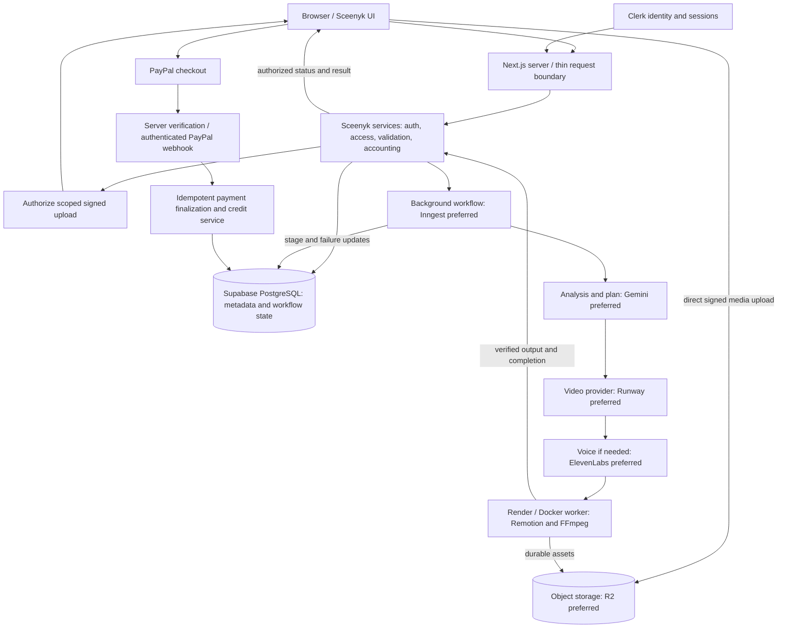

# Architecture Context

## Gemini understanding and production plans — real provider and hosted persistence verified, 2026-10-11

The authorized AI slice replaces the unsupported preparation handoff. `lib/workflows/generation.ts` calls `lib/ai/server.ts`, which loads the authoritative claimed job, owned project/user/reservation and exact snapshot assets; `lib/ai/providers/gemini.ts` owns Google-specific REST and media transfer. No Google/Vercel AI SDK was installed: native REST and existing Zod suffice. Server-only `GEMINI_API_KEY` is required; `GEMINI_MODEL` centrally overrides default `gemini-3.8-flash`. No model fallback or retail tariff is inferred.

Private R2 objects are read server-to-server with their verified ETag and byte size, streamed into authenticated Google Files API uploads and deleted after the attempt. No R2 URL, public access or temporary signed capability is sent to Google or persisted. Google automatically expires residual Files API uploads after 48 hours if a crash prevents cleanup ([official Files API documentation](https://ai.google.dev/gemini-api/docs/files)). Up to eight sources and 100 MiB aggregate are execution safeguards; unsupported inputs fail safely rather than being ignored. Existing upload policy remains separate.

`lib/ai/plan.ts` defines strict schema version 1: summary/intent, per-asset observed summaries/duration, exact requested duration/aspect/tone/style, narration flag, ordered scenes, audio and editing notes. Scenes distinguish original/transformed/generated sources and contain duration, optional owned asset/time range, description, transformation instructions, narration, caption and transition. Contextual validation checks IDs, settings, source ranges, scene order, total duration and narration consistency before persistence. Creative fictional scenes are separate from observed facts. This is a plan, never a generated video.

New migration 008 adds immutable `generation_plans`, claim-bound `generation_analysis_attempts` and `generation_jobs.production_plan_ready_at`. Service-only RPCs begin at most two provider attempts and atomically save valid plan + usage + readiness. Browser roles cannot read/write these tables or invoke RPCs; application DTOs expose only readiness. Plans are never overwritten. `processing/analyzing` advances to `processing/planning`; readiness pauses there, never marks completed and preserves the existing reservation for future production. Cron excludes ready plans from stale failure, while unfinished AI claims still fail after 15 minutes through the existing exactly-once settlement trigger. No second accounting charge is introduced.

Inngest memoizes steps. Persisted plan reuse also prevents another paid call after a lost save response. An attempt begun without a persisted result is uncertain and is not automatically replayed; an active concurrent copy waits during the five-minute uncertainty margin. Known invalid output/rate limit/outage gets at most one additional numbered attempt with durable backoff. Usage records retain requested/returned model, response ID, token counts, modality details, measured media duration where Google supplies it, attempt outcome and timestamps. Monetary cost stays null: observed token usage does not establish the account's actual invoice/free-tier status or production retail rates. User-applied migration 008, actual text/image/video provider results, hosted current-workflow persistence and duplicate reuse are verified. Local-source workflow acceptance uses the official Inngest execution engine with real external services, not Cloud transport. Browser/deployment status is recorded in the tracker; later historical baseline descriptions below are superseded for this slice only.

**Commercial cost contract (2026-10-11):** [pricing.md](pricing.md) defines the server-only `lib/pricing/` boundary, validated quotes, explicit cost review/confirmation, account-locked stale/free/balance checks and immutable pricing version provenance. Paid rates default unavailable; optional configuration is development/test-only. Migration 007 is exercised against hosted development data through real quote/admission/provenance checks; the deployed core quote/admission/ownership/Cloud-restoration flow also passes. Exact acceptance and final refinements are recorded in the tracker. Existing 006 allowance/reservation/ledger/settlement remain unchanged. New jobs must confirm a quote before dispatch. Credits have no assumed currency/provider-unit conversion. PayPal development/hackathon testing is Sandbox only; intentional future Live switching belongs to a separately authorized payment service. This current contract supersedes earlier direct-admission/unavailable-resolver descriptions below.

**Accounting foundation (2026-10-11):** see [accounting.md](accounting.md) for the approved exact two-lifetime/10-second contract. Separate free counters and paid balances, one owner-bound reservation per job, immutable paid movement ledger, transactional admission before dispatch, claim-bound verified stored-result settlement, and atomic terminal-failure restoration. Stable request/job references and account-row locking protect retries and contention. Migration 006 is user-applied and matching code is deployed; real Clerk/Supabase/Inngest Cloud admission, claim, browser-independent restoration and persistence pass. Successful consumption is verified with isolated storage fixtures, not live generated output. Existing jobs are explicitly historical/unaccounted, never retrocharged. Trusted paid cost is unavailable until tariffs are approved; no payment/provider/rendering unit is authorized here. Earlier no-accounting descriptions below record the pre-unit baseline.

Technical boundaries for Sceenyk's prompt/media-to-finished-video platform. Read with [overview.md](overview.md), [ui-context.md](ui-context.md), [design-system.md](design-system.md), [ai-workflow-rules.md](ai-workflow-rules.md), [code-standards.md](code-standards.md), and [progress-tracker.md](progress-tracker.md).

**Repository inspection: 2026-10-10.** **Confirmed** means present in current source/dependencies; live verification is explicitly identified below and in the tracker. **Planned** means specified architecture or the preferred direction supplied for this document, with no integration yet. **Undecided** identifies details still requiring a decision. All service/data-flow diagrams and contracts below are planned unless explicitly identified as implemented.

The public UI foundation includes landing/themes and verified Clerk/application identity, deployed owned projects and private R2 media. Generation persistence and Inngest dispatch have local/deployed Cloud acceptance: trusted preparation, atomic claims, retries, duplicates and cron recovery. Accounting now has separate entitlement/credit balances, immutable ledger and atomic reservations/settlement; its current verification is in the tracker. No AI production, output production, payments or heavy rendering worker exists.

**Public UI contract (2026-10-09):** use existing CSS tokens and shadcn/Base UI controls. Theme initialization runs before paint; saved `sceenyk-theme` overrides system preference, otherwise follow the system. Preserve root font classes, keep the landing page static, and tolerate unavailable browser storage. Public navigation uses working section anchors. Paid pricing remains unpriced preview copy until product rates are approved.

**Creation workspace (updated 2026-10-11):** public `/create` retains category, prompt, local Files/previews and settings. Explicit Save draft stores the validated brief. Upload first saves an unsaved project using the stable UUID/in-flight promise, retains Files while changing URL, sends bytes directly to private R2 and verifies stored content before success. Reopen restores owned metadata/private previews. Local Files stay outside brief payloads; temporary URLs are cleaned up. Permanent deletion is deferred. Generate atomically commits an immutable owned request and entitlement reservation before durable dispatch. Preparation/delivery feedback shows persisted truth; the unsupported provider handoff safely fails without output and restores the reservation once.

**Development payment invariant:** all future payment development/testing uses PayPal Sandbox only, with no real-money transactions or Live credentials. Future payment configuration must separate environment/credentials behind the payment service so production can deliberately switch to Live later. This UI unit adds no payment code or credentials.

**Dashboard/authentication contract (updated 2026-10-11):** `/dashboard` and `/projects/[id]` require verified Clerk sessions and fail closed when configuration is missing. One root Clerk provider/theme and existing shells remain. `/` and `/create` are public. Signed-out private routes/actions redirect to the fixed `/?auth=sign-in` modal entry; authentication completes at `/dashboard`. Browser return URLs/owner claims never authorize access. Every project service independently uses `ensureAppUser` without a supplied owner. Dashboard queries only owned project summaries/counts, ordered by updated time and ID descending, eight per page. Project read/update queries include both ID and owner. Genuine database failure is distinct from empty/not found. Latest job status and real free allowance appear; paid access is unavailable and templates remain previews. Private workspace state is keyed by account/project, and hidden until the active Clerk identity matches its server-resolved viewer. No private shared cache is introduced.

## Stack

| Layer | Technology | Role |
| --- | --- | --- |
| Application — Confirmed foundation | Next.js 16.4.0 App Router, React/React DOM 19.3.0 | Static public `/` and `/create`; protected request-time dashboard and `/projects/[id]`; thin authenticated project/media/generation/allowance Server Actions. Deployed owned-project and accounting admission/restoration acceptance verified. |
| Language/tooling — Confirmed | TypeScript 5.9.3, ESLint 9.39.5, npm, Zod 4 | Strict typed code and runtime project validation. `npm run test:generation` runs isolated SQL/service integration checks using development-only PGlite and Node assertions. |
| UI — Confirmed foundation | Tailwind CSS 4.3.3, `@tailwindcss/turbopack` 4.3.3, shadcn 4.21.3 (`base-nova`), Base UI 1.8.0, Lucide React 1.52.0 | Shared shells/EmptyState/themes, media previews, quote review and persisted generation stages. Actual hosted production-plan readiness survives owner refresh/reopen and denies a second account. Final video/results remain Planned. |
| Typography — Confirmed | Inter and Geist Mono via `next/font/google` | UI/headline and mono fonts; global aliases live in CSS. |
| Authentication — Development verified | Clerk Next.js 7.9.13, Clerk UI 1.39.1 | Development-only provider, centered official modals/account controls, proxy plus server resource protection. No dedicated auth pages. |
| Database — Development persistence verified | Supabase PostgreSQL via `@supabase/supabase-js` 2.117.3 | One server-only SDK layer with hosted identity/projects/assets. Live media ownership/persistence verified; SQL grants/constraints tested in isolated PostgreSQL, not a full hosted catalog audit. No ORM/browser database/Supabase Auth. |
| Object storage — Development verified | Cloudflare R2 via AWS S3 SDK/signing | Real direct signed browser PUT, server HEAD/ranged-signature verification, authorized GET and refresh/reopen verified against `sceenyk`. Generated assets and production deployment remain future work. |
| AI orchestration — Understanding/planning implemented | Shared server-only `lib/ai/` service and provider boundary | Existing Zod plus native REST; no extra AI SDK installed. Authoritative job/media loading, validated immutable plans and server-only usage. |
| Video understanding — Development verified | Google Gemini, default `gemini-3.8-flash` | Actual text/image/video understanding and schema-v1 planning succeed; hosted SQL persistence/duplicate reuse verified. No generated video. |
| Video generation/transformation — Planned preferred | Runway, or the first provider selected for the supported MVP path | Generate/transform scenes behind a replaceable video service. No SDK/provider implementation exists; final provider/model selection remains open. |
| Voice — Planned preferred | ElevenLabs | Narration/voiceovers when required by the chosen creation path; model/voice policy remains Undecided. |
| Video assembly — Planned preferred | Remotion | Programmatic compositions combining scenes, captions, audio, overlays, and animations. Not installed/configured. |
| Video processing — Planned | FFmpeg | Cutting, resizing, transcoding, audio extraction, frame-rate conversion, compression, thumbnails, and final processing. No worker invocation or repository-managed binary exists; host availability was not tested. |
| Background workflow — Deployed foundation; new AI source verified locally | Inngest SDK 4.23.0; official test engine 1.0.0 | Existing Vercel/Cloud dispatch/claims/recovery remain verified. Current source adds durable Gemini analysis/planning, real external-service acceptance through the official engine and immutable plan reuse. New AI code is not yet deployed/Cloud-verified. Four workflow retries and minute reconciliation remain. |
| Heavy processing — Planned preferred | Render + Docker | Worker environment for FFmpeg, Remotion, and long/CPU-heavy media work outside lightweight web hosting. No Dockerfile/worker deployment configuration exists. |
| Payments — Planned | PayPal | Hackathon credit purchases first; subscriptions, marketplace purchases, and eventual creator payouts are later capabilities. No checkout/webhook/service implementation exists. |
| Deployment — Web hosting confirmed; heavy workers planned | Vercel for Next.js; Render preferred for future media workers | `https://sceenyk.vercel.app` is deployed in Vercel Production, confirmed by the user and live endpoint checks. Inngest uses its stable `/api/inngest` URL. No Render/worker deployment exists. |

Installed versions above were checked with `npm ls --depth=0`; its extraneous platform/WASM packages are not product integrations. `.gitignore` mentioning `.vercel` and the starter page linking Vercel are not evidence of deployment.

**Deployed acceptance boundary (2026-10-10):** real Chrome/Clerk → Vercel Production → Inngest Cloud `production` → Supabase generation delivery and claim pass. User redeployment resolved the initial missing-Clerk configuration. Official signed introspection succeeds, unsigned/invalid execution is rejected, duplicates exit without a second claim, and real minute reconciliation recovers a deliberately unsent development row while Chrome is fully closed. Reopened/refreshed original and recovered generations, A/B isolation, strict browser input and deployed secret checks pass. The user confirms `INNGEST_DEV` is absent. Cloud workflow COMPLETED means its honest handoff succeeded; generation rows safely fail because no production pipeline/output exists. No provider or accounting work was added. See [progress-tracker.md](progress-tracker.md) for exact event/run identifiers and limits.

**Environment baseline (2026-10-10):** ignored `.env.local` contains working Clerk development and new Supabase development project credentials. The blank committed `.env.example` lists `NEXT_PUBLIC_CLERK_PUBLISHABLE_KEY`, server-only `CLERK_SECRET_KEY`, `SUPABASE_URL`, `SUPABASE_SECRET_KEY`, and the optional legacy `SUPABASE_SERVICE_ROLE_KEY` alternative. Clerk requires `pk_test_`/`sk_test_` and rejects production prefixes. Privileged Supabase and configured `R2_ACCOUNT_ID`, `R2_ACCESS_KEY_ID`, `R2_SECRET_ACCESS_KEY`, `R2_BUCKET_NAME` stay server-only; `MEDIA_MAX_UPLOAD_BYTES` is optional. Missing Clerk configuration denies the dashboard; database/profile failure produces a distinct signed-in workspace error. No secret value is logged or committed. See [authentication.md](authentication.md) and [database.md](database.md).

## System Boundaries

### Existing structure

The repository uses root-level folders, not `src/`. The `@/*` TypeScript alias resolves to `./*`; preserve that structure.

| Existing location | Current responsibility |
| --- | --- |
| `app/` | Root document/theme/CSS, public/private workspace/dashboard composition and thin authenticated project/media/generation actions. `/api/inngest` is the official signature-protected workflow Route Handler. |
| `components/ui/` | shadcn/Base UI Button and token-adapted Dialog/Sheet. |
| `components/` | Shared brand/navigation/footer/themes/auth/artwork/EmptyState; landing/creation/dashboard composition, explicit draft save states, project metadata cards and load-failure UI. No database access in presentation. |
| `lib/` | Theme/utilities; `auth/` verifies Clerk and resolves application identity; `db/` owns the sole privileged SDK/config/schema contract; `projects/` owns shared choices/types/validation and authenticated owned persistence. |
| `public/` | Sceenyk preview brand mark and unused stock SVGs. |
| `context/` | Product/UI/design specifications, workflow, coding standards, progress, and this architecture. |
| `designs/` | Two PNG references for the same UI in light and dark modes. |
| Root configuration | npm manifest/lockfile, TypeScript, ESLint, Next.js, shadcn configuration, and agent instructions. |

`app/globals.css` owns semantic theme tokens and Tailwind 4's CSS-first configuration. Light is `:root`; `.dark` on `<html>` switches themed tokens and utilities. Inter/Geist Mono are loaded in the root layout. `ThemeController` synchronizes system/storage events and `ThemeToggle` persists explicit choices. The inline root-head initialization follows the installed Next.js flash-prevention guide; only the root receives `suppressHydrationWarning` for the class change. Landing content remains server-rendered and statically prerendered. Keep one shared visual system and generic shadcn primitives, preserving behavior/accessibility.

### Intended boundaries as features are introduced

These are future locations/contracts, not created folders. Add only what the requested vertical slice needs; document changes rather than scaffolding the entire architecture.

| Boundary | Responsibility and limits |
| --- | --- |
| `app/` | Routes, layouts, thin Route Handlers/Server Actions, loading/error boundaries, and page composition. Reusable business logic belongs in services. |
| `components/ui/` and `components/` | Generic shadcn primitives and shared Sceenyk UI composition. No secrets or server-only accounting/provider logic. |
| `features/<feature>/` | Feature-specific components/hooks/logic when the feature is large enough to justify it. |
| `lib/auth/` | Verified Clerk identity/session helpers and application identity resolution. |
| `lib/db/` | Server-only Supabase SDK/config/types. Authenticated owned project operations live in `lib/projects/`; no second database library. |
| `lib/storage/` | Asset keys/metadata, upload authorization, signed URLs, download/deletion, and storage-provider adapter. |
| `lib/ai/` | Language/multimodal analysis and planning contracts; SDK/provider-specific implementation below this boundary. |
| `lib/video-ai/` | Video-generation/transformation interface and provider implementations, e.g. future `providers/runway.ts`. |
| `lib/voice/` | Voice-generation interface and adapters. |
| `lib/payments/` | PayPal checkout, verification, webhook handling, payment finalization, and later subscription/payment capabilities. |
| `lib/accounting/` | Server-only owned allowance read, owned allowance and verified-storage settlement adapter; `lib/pricing/` owns cost resolution/quotes; transactional reservation/ledger operations live in migration 006 RPCs/triggers. |
| `lib/pricing/` | Validated server-only retail configuration, owned quote service and safe quote DTO. Account-locked quote confirmation delegates to the unchanged accounting admission/settlement. See pricing.md. |
| `lib/generation/` | Request-to-production orchestration, stage contracts, persistent job state, and coordination of provider/worker services. |
| `lib/validation/` | Shared runtime schemas for untrusted request/provider/webhook/configuration data. |
| `types/` | Genuinely shared domain types, including the adopted job-state contract. |
| Workflow and migrations | `lib/workflows/` owns Inngest client/functions; `lib/generation/dispatch.ts` owns outbox sending; `supabase/migrations/` holds SQL. Preserve applied files. Heavy media workers remain future work. |

Prefer Server Components; use small client components for interactive state and controls. The installed Next.js configuration enables `cacheComponents` and `partialPrefetching`; read its local guides before implementing request-time/session reads, use appropriate Suspense boundaries, and never share authentication decisions or private data through an unscoped cache. Thin routes/services validate, authenticate, authorize, and delegate; no application framework setting should be disabled to conceal an integration error.

## Storage Model

### Persistent generation-job contract — hosted development persistence verified

The foundation in `lib/generation/` persists requests/state; dispatch extends it through Inngest below and migration 006 adds transactional accounting admission. Providers/output remain unimplemented. Generate requires a saved owned project and nonempty prompt. Its immutable snapshot contains current prompt/category/settings and all uploaded project asset IDs. Local Files must be uploaded or removed first. Later brief edits do not change a job; Generate does not implicitly save the draft.

`generation_jobs` has a server-generated UUID, verified owner/project composite FK, request UUID unique per project, validated versioned JSON input snapshot, status/stage, safe failure code/message and database timestamps. Snapshot, ownership and request identity are immutable. Creation retries reuse the request UUID and identical normalized snapshot; a changed payload conflicts. Multiple jobs per project remain possible. No progress percentage, provider fields, result asset, credit fields or one-job-ever restriction is introduced.

See [generation-jobs.md](generation-jobs.md) and [generation-dispatch.md](generation-dispatch.md) for setup/evidence. Shared `lib/generation/contract.ts` rules are SQL-enforced. States are queued → processing → completed|failed, also queued → failed; stages preparing/analyzing/planning/generating/voice/rendering move forward only. Queued/completed have no stage; failed may retain its last stage. Terminal jobs are immutable and errors use fixed safe messages. Request-authenticated helpers use owned compare-and-set; workers use separate service-only atomic RPCs. No browser status-mutation action exists. This worker stops at preparing and fails its unsupported handoff; it never completes an output.

Workspace recovery reads the latest job by creation time and ID descending, limited to one, independently checking Clerk → app user → project → job. Explicit refresh and activation/pageshow/visibility use uncached owned reads; no progress timer exists. Dashboard reads at most one latest job for each of eight visible projects; read failure differs from Draft. DTOs omit owner/worker identity while retaining request UUID and safe dispatch status. Actions preserve local Files. Worker authority is the separate signed/RPC boundary below; future output finalization is unimplemented.

### Owned draft projects — prior unit and historical baseline

The media unit now confirms projects exists in hosted metadata and verifies real project-first save/retry/refresh/reopen. Historical migration/acceptance notes below describe the prior unit. Local media has since gained a separate asset schema/storage boundary described below; it still never enters brief payloads.

Historical at the beginning of the 2026-10-09 project unit: saved creative briefs existed in source and the initial hosted Data API inspection exposed only `app_users` with eight verified columns; the new projects migration is pending user application. `projects` has UUID ID/owner FK, title, category, prompt, current aspect ratio/duration/style/tone choices, draft status and database timestamps. Browser roles have no access; service_role can insert/read and update only editable fields. An owner/update-time/ID index supports newest-first pagination. Duration remains a constrained text value matching the current controls (10/15/30 seconds).

Every exported project service resolves the request through `ensureAppUser`; no operation accepts an owner. Reads and updates filter by both ID and that application identity. Strict Zod validation rejects unknown ownership/status/media fields. A new workspace retains one UUID across save attempts; insert uniqueness plus an owner-scoped update on a duplicate ID makes retries safe without an unrestricted upsert. Existing project saves only update and never recreate a missing or foreign record.

Missing/foreign/invalid project reads return the same explicit unavailable UI inside the streamed boundary; they expose no workspace fields or existence details. This expected result retains the Clerk provider rather than throwing during streamed rendering. Private-route metadata is always noindex; streamed responses use 200. Workspace controls use per-instance React IDs and radio groups to preserve associations across retained routes.

Public `/create` stays available. Save is explicit, authenticated, and confirmed by the server. A saved draft has the private stable URL `/projects/[id]`, reusing the same workspace under the public visual shell with request-time authentication/ownership behind Suspense. No private shared cache is introduced; saves invalidate dashboard/project router data. Only brief fields are restored; local Files, object URLs and paths never enter persistence. There is no autosave, delete, sharing, generation, credit, storage or payment work. Migration application and live acceptance remain pending until recorded in the tracker.

### Supabase PostgreSQL — Minimal identity verified in development

The first database unit adds `lib/db/config.ts`, `server.ts`, and `types.ts` with the official Supabase JavaScript SDK, no second ORM or browser client. `lib/auth/ensure-app-user.ts` has no identity argument: it verifies the request through Clerk, retrieves that account's server profile, and atomically upserts only `clerk_user_id`, verified primary email, nullable first/last names, and image URL. `onConflict: clerk_user_id` preserves the application's UUID and creation time; the database owns update timestamps. It returns the application record to server code. No Clerk password/session/token, browser-supplied ID, or Supabase Auth session is stored or used.

`ensureAppUser` awaits `connection()` before real-request identity work. The dashboard layout and every project service independently resolve identity; auth/framework signals propagate, never becoming application failures. Database fetches remain uncached and bounded. Configuration/profile failures log only constrained codes and render controlled signed-in failures. No cross-request identity cache or client synchronization exists.

`supabase/migrations/20261009000100_app_users.sql` is the **initial migration applied by the user through SQL Editor**, authored for the new development database selected by the user. Repository inspection found no existing database client, schema, or migration convention. The privileged Data API metadata initially exposed no application tables; after user-confirmed application, its eight-column app-user contract and real writes were verified. The migration transaction inspects public table existence and refuses an existing application schema rather than guessing or replacing a user table. It introduces only `app_users` (UUID primary key, unique nonempty Clerk ID, nullable profile fields, timestamps), its timestamp trigger, RLS enabled with no browser policies, and SELECT/INSERT/UPDATE for `service_role`. `anon`, `authenticated`, and PUBLIC have no table grants. The privileged SDK bypasses RLS, so verified Clerk identity at the server remains mandatory. Other domains/tables and webhook synchronization remain planned.

Set server-only `SUPABASE_URL` and `SUPABASE_SECRET_KEY` (preferred `sb_secret_` key) for that development project; legacy `SUPABASE_SERVICE_ROLE_KEY` is an alternative. No `NEXT_PUBLIC_*` database variable is required. Configuration rejects public privileged-key variables, invalid endpoint URLs and public/anon key classes. `.env.example` is blank and actual keys remain ignored. The user confirmed migration application; real hosted unique-key rejection, two-account synchronization, repeated refresh/re-login, profile updates/null restoration and stable UUID/creation time passed. Isolated PostgreSQL verified RLS and grants. A separate hosted catalog/browser-role audit was not performed without a SQL connection or public key; applying the migration and successful service-role writes are the available hosted evidence.

PostgreSQL records application relationships and workflow truth:

- Application user/profile records mapped to Clerk identity; projects and ownership.
- Generations, generation jobs/states, prompts/configuration, stage results, failure context, and provider job references.
- Asset metadata and project/user associations, not large media binaries.
- Credit balances/reservations and ledger/transactions, payments, and eventual subscriptions.
- Later creator templates, listings/purchases, and creator earnings metadata.

These are conceptual data categories, not existing tables/columns or a complete schema. Introduce migrations only for the current unit after defining relationships, constraints, indexes, and access policies. Never rewrite a migration that may have been applied; record application/verification status. Privileged database access must still enforce ownership. The current generation unit reinspected the hosted Data API prerequisite tables/columns before authoring migration 004; future domains remain unspecified.

### Object storage — private R2 project media, current authorized unit

Application → `lib/media/server.ts` (verified Clerk/application identity and project ownership) → `lib/storage/server.ts` → `lib/storage/r2.ts`. R2-specific SDK/signing stays in the provider adapter. `app/actions/media.ts` exposes thin metadata-only Server Actions with Next.js same-origin protections, safe errors and framework signal propagation. Files go from browser to R2 through XHR, never through a Next.js upload body.

The new `20261009000300_project_assets.sql` migration requires `app_users` and `projects`. Metadata includes server-generated asset ID/key, owner/project, stable client upload-request UUID, original filename, canonical MIME, declared byte size, category, pending/uploaded/rejected status and verified ETag. Composite project/owner FK prevents inconsistent ownership; request uniqueness makes retries/concurrent authorization reuse one row. Browser roles are denied; service_role may insert/read and update only status/ETag. Every media operation independently resolves authenticated identity and filters owned project/asset IDs. DTOs omit owner, upload request and storage key.

R2 keys use server-generated UUID path segments under `users/{appUserId}/projects/{projectId}/{assetId}/{randomUUID}`. Filenames stay metadata only. Upload authorization lasts five minutes and binds Content-Type, Content-Length and If-None-Match `*`. Conditional PUT prevents overwrite/replay after any successful object write. Server finalization checks HEAD metadata and reads at most 8192 bytes with an ETag condition, detecting supported file signatures using `file-type`. Successful repeated finalization returns the same asset; missing storage stays pending, mismatched content becomes rejected. Full decoding, malware scanning and media transforms are not implemented.

Private GET links last fifteen minutes, are issued only for owned uploaded assets, and use private/no-store response caching. They are bearer capabilities: an authorized owner can share a link until it expires. Object keys necessarily appear in that owner's signed URL, but never in another user's results. Metadata stores stable keys, never expiring URLs. Reopened workspace queries owned metadata and requests a fresh read link only for the active preview; expired/decode-failed previews offer Refresh preview. Activation/pageshow/visibility restores fresh owned metadata through an uncached Server Action, without time-based polling. Finalization merges its result locally rather than revalidating the active route, preserving remaining local Files after the address changes from `/create`.

An explicit local Upload to project saves a new project successfully first, reusing the existing first-save UUID/promise to avoid duplicate projects. It then updates the address to `/projects/[id]` with supported native history replacement, retaining local Files while refresh gains a stable reopen path. Local selections remain removable; uploaded assets remain attached and permanent deletion/abandoned-object retention are deferred. Pending rows reopen with Check upload for completion recovery. See [media-storage.md](media-storage.md) for configuration, CORS, temporary size safeguard and deployment acceptance.

**Live transport diagnosis (2026-10-10):** the browser received the signed URL and called XHR `send(File)`, but the bucket initially refused OPTIONS because CORS omitted `If-None-Match`. The user added that header without weakening signed conditional writes; actual OPTIONS 204 and PUT 200 then passed. Check upload only verifies an existing object and cannot resend a File lost on reload. Temporary development transfer diagnostics recorded stage/status only and were removed after verification; no signed URLs, headers, bodies or credentials were logged. Public r2.dev/custom-domain access is disabled per the user's settings confirmation; unsigned S3 access is checked separately in live acceptance.

The following broader generated-media direction remains planned:

Store original uploaded video/images/audio, generated images/scenes, transformed clips, narration, thumbnails, intermediate render assets when needed, and final videos separately from PostgreSQL.

Database metadata should describe the stable storage key/reference, MIME type, byte size, duration, width/height where applicable, owner, project, creation time, and processing state. Generate expiring signed URLs when authorized access is needed; do not use an expiring URL as the only durable asset identity.

Prefer authorized direct browser-to-storage uploads for large files. The server determines owner/project association and allowed keys/type/size; completion must be checked before an upload is treated as ready. Downloads and provider/worker media access must be scoped to their task. User filenames or browser-reported metadata are not authoritative storage paths or validation.

Private uploaded-project delivery and explicit formats are now defined by this unit. Private bucket/CORS behavior is development-verified; retention/deletion and final product size rules remain Undecided. Generated public marketplace assets may adopt a separate later policy. An asset is not public merely because its key is known.

### Temporary processing storage — Planned

Workers may download stage inputs into temporary local files for FFmpeg/Remotion processing. This disk is scratch space, never permanent application storage. Clean up after success/failure under the approved lifecycle policy, upload durable outputs to object storage, and persist references needed for retries. A local worker path must never be the user's final result link.

## Auth and Access Model

### Authentication and application identity

Clerk is the specified identity/session source of truth. Visitors can explore the public product without signing in. Starting generations, creating/saving/viewing private projects, buying credits, subscribing, and account-dependent creator/marketplace features require authentication.

Sign-in/sign-up opens through centered Clerk modals/overlays; there are no dedicated `/signin` or `/signup` pages and no second custom password/auth system. The development SDK/provider, official centered modals/account controls, server guard and real session flows are verified. See [authentication.md](authentication.md).

Protected server operations derive the user from verified Clerk sessions. `ensureAppUser` maps that request identity uniquely to `app_users` through the server-only Supabase SDK. Clerk continues to own authentication. Database-safe upsert tolerates repeat/concurrent requests without duplicate profiles; account updates independent of activity via webhooks remain deferred.

### Ownership and authorization

- Each private project has an owner. Generations/jobs belong to a project and/or user with consistent ownership; input/output assets are associated with their user/project.
- Balances, ledger entries, subscriptions, and payments belong to the relevant user. Later marketplace listings belong to their creator; public listing metadata does not make private project/media data public.
- Server/data access checks enforce authentication, resource ownership, permissions, and entitlements where required. Changing a URL/request ID must never reveal another user's private data.
- Access is server-mediated: browser grants are revoked and RLS has no browser policies. The privileged SDK bypasses RLS, so every project operation derives its owner through Clerk/application identity; read/update queries filter owner plus project ID. Hosted project/media persistence and two-user ownership pass, including deployed owned-project acceptance. Supabase Auth remains unused.
- Signed media URLs and job-status/result endpoints need ownership enforcement as well as project mutations. Worker/provider callbacks use verified service identities and job association, not browser-supplied ownership claims.

## Generation Architecture

### Planned production pipeline

1. Accept the user's prompt, supported creation type/options, and optional ready media references.
2. Verify Clerk authentication; validate inputs and project ownership/access.
3. Calculate server-authoritative free-generation eligibility or credit entitlement/cost and reserve capacity according to the approved policy.
4. Persist the generation and owned queued job, then dispatch durable background work. Define a recoverable handoff so a dispatch failure does not strand capacity or accepted jobs; do not claim a distributed transaction across PostgreSQL and a workflow provider.
5. Analyze prompt/media through the AI service (Gemini preferred), producing validated scene/action/timestamp context where needed.
6. Create a production plan: required scenes, script/commentary, assets, timing, and supported settings.
7. Generate or transform scenes through the replaceable video service (Runway preferred initial candidate).
8. Generate/refine script/commentary and voiceovers where the plan requires them (ElevenLabs preferred). Script preparation may occur before scene generation when required; stages follow explicit dependencies.
9. Assemble media, captions, audio, and overlays into a composition (Remotion preferred).
10. Render/process in the heavy worker environment using Remotion/FFmpeg as needed.
11. Upload the final output to object storage, verify it is retrievable, and persist its stable reference/metadata.
12. Finalize generation state and usage accounting under the approved settlement policy, then expose preview/download in the project.

Paths may omit unnecessary stages. The first supported creation category and stage contracts must be defined before implementation; this is not permission to build every category/provider. Job submission returns a reference promptly. The browser displays persisted progress and can revisit later rather than holding a normal request open for production.

### Durable dispatch and recovery — development verified

Inngest is the sole workflow coordinator. A generation row is also the transactional outbox: creation commits `queued/pending` before sending `sceenyk/generation.requested`, with only `generationJobId` in event data. Database RPCs reserve numbered attempts with a two-minute cooldown and acknowledge only the current attempt. A late acknowledgement cannot overwrite a claim. A minute cron reconciles bounded batches, including accepted events that remain unclaimed; recovery needs no browser. Each attempt has a stable event ID; the database claim provides durable duplicate protection beyond event deduplication windows.

Official SDK signature verification protects cloud execution. Unsigned local development is explicit and disabled in production. Workers use the server-only database client without interactive Clerk auth, revalidate the authoritative job/project/application-user/assets relationship and claim atomically using the Inngest run ID. The same run can resume after a lost database response; another delivery exits. Browser roles cannot invoke worker RPCs or alter dispatch metadata. Temporary errors use four Inngest retries; invalid events/integrity failures are non-retryable.

This unit stops at `processing/preparing`. After a durable one-minute pause it records a safe failure because no production pipeline is connected, never a completed output. The cron also fails claims older than fifteen minutes, covering exhausted retries and crashes. Terminal jobs cannot be reclaimed. No heartbeat or automatic replay of possibly expensive work is introduced. Future providers must replace this explicit handoff and revisit execution limits/idempotency before extending it.

Recovery requires registered, active Inngest functions or a running local Dev Server. During service downtime rows remain recoverable when it returns; monitor cron failures/pauses and oldest queued age. Actual Cloud reconciliation recovered a deliberately unsent development generation with Chrome closed and preserved one row/claim. No temporary Cloud handler failure or fifteen-minute hosted crash soak was injected. See [generation-dispatch.md](generation-dispatch.md) and [progress-tracker.md](progress-tracker.md) for setup and evidence.

### Persistent state and recovery — future production stages

The persistent job state machine is implemented: `queued`, `processing`, `completed`, `failed`, with separate forward-only stages. Upload remains a separate asset state. Production stage inputs/outputs are future work. Accounting gates admission/dispatch and terminal settlement; only verified stored-result completion consumes a reservation.

Persist enough information to show progress after reload, diagnose failures, and safely resume: job/generation/project owner, validated request/configuration, current state/stage, stage inputs/outputs, provider job IDs, attempt/timing information, safe error context, accounting reference, and final asset reference.

Retry recoverable stages without rerunning completed paid work. Bound retries, coordinate concurrent workers, verify uncertain provider acceptance before resubmission, and record failure/compensation outcomes. Timeouts or worker interruptions must become recoverable/stalled/failed outcomes under the adopted workflow, not leave jobs permanently processing. Temporary processing artifacts and user-facing status must follow actual durable state.

### Provider and execution boundaries — Planned

Application → Sceenyk generation service → provider interface → provider adapter.

For example, a future `generateVideo()` contract delegates to `lib/video-ai/providers/runway.ts`; pages and shared UI do not depend on that provider's payloads. Apply the same principle to language/multimodal models, voice, storage, and payments. Validate adapter outputs into shared Sceenyk contracts, keep keys server-side, and record external job references.

Inngest is the implemented workflow coordinator; Render/Docker remains the preferred future heavy processing environment. Signed Inngest execution, claims, retries and recovery are defined above. Rendering-service authentication, limits, completion callbacks and deployment remain future decisions. Do not run heavy FFmpeg/Remotion work in lightweight web requests.

## Payments and Credits

### Free usage and entitlement — Accounting foundation

Every application user receives **two lifetime free video generations, each limited to ten seconds**. This is a separate entitlement, not paid credits. Authenticated identity, duration and available allowance are the only eligibility conditions. Migration 006 backfills existing users and initializes new app-user inserts once; profile upserts do not reset counters. Current 10/15/30-second options make 10 seconds the eligible choice. Paid pricing/access is unavailable; longer/exhausted requests fail safely without a job. See [accounting.md](accounting.md).

The server determines entitlement and trusted credit cost. The central pricing service defaults to unavailable paid rates; explicit development/test rules may provide quotes. No browser cost override exists. Subscription pricing, credit-pack pricing, credits by generation type/duration and provider-cost conversion remain unresolved. PNG prices are illustrative. There is no purchase or subscription implementation.

### Ledger, reservations and settlement — Accounting foundation

`generation_accounts` holds separate free total/reserved/consumed counters and available/reserved paid credits. `generation_reservations` binds one free/credits outcome to each owned job. `credit_ledger` is immutable, recording each paid reservation/consumption/release with owner/job, amount, direction, signed balance deltas, reason, unique job/type reference and timestamp. No grant/purchase/adjustment API is added. Exact integer accounting units are bounded to JavaScript's safe integer range; this defines representation, not commercial pricing.

Atomic admission locks the user's account and commits job + reservation together before durable dispatch. Stable project/request UUID and immutable snapshot return the same job without another hold. Constraints prevent negative balances or free reserved+consumed exceeding two. Dispatch and claims require reservation. Terminal failures atomically release exactly once; recoverable send outages retain holds for cron recovery. Completion requires a claim-bound verified private R2 video receipt in `generation_result_receipts`, job completion and reservation consumption in one transaction. The server-only adapter verifies canonical storage key, size/MIME/signature/ETag; future renderers must validate usable output and publish immutably first. No current worker produces output or consumes a success. Browser roles have no accounting access; service_role can read tables and execute restricted RPCs but cannot directly write balances/history. Historical jobs are marked unaccounted and never retrocharged.

### PayPal verification — Planned

The browser initiates checkout through the server-defined payment contract. PayPal success must be verified on the server against the intended payment/user, amount/currency, and final status; browser success alone grants nothing. Verify webhook authenticity before processing.

Payment finalization must be **idempotent**: receiving the same successful payment/event repeatedly must not grant credits twice. Enforce persistent payment/event identity and atomic finalization across return callbacks, duplicate webhooks, retries, and concurrent handlers. Record the payment and associated ledger/entitlement outcome before reporting capacity granted. Keep provider verification in `lib/payments/` and accounting in its shared credit service; subscriptions use their approved lifecycle rules when introduced.

## Data Flow

The following diagram is the intended architecture; its external services and connections are **not implemented**.

- **Application data:** browser → Next.js verified Clerk identity → validated/authorized service → PostgreSQL. Read results are scoped to the user and contain only needed client data.
- **Large uploads:** browser requests authorization → server issues a scoped signed upload → browser uploads directly to object storage → server verifies completion/metadata and records the asset association. Providers/workers retrieve authorized inputs from storage; PostgreSQL records their references.
- **Generation:** Next.js persists/reserves an accepted job → durable workflow invokes required provider stages → worker assembles/renders → output is stored → generation/accounting records are finalized → authorized polling/subscription/read returns state and result. Progress transport is Undecided; completion is not inferred from elapsed time.
- **Payments:** browser → PayPal checkout → server verification/webhook → idempotent finalization → payment/credit/subscription records in PostgreSQL. A signed-in checkout initiator and a verified provider event have different authentication contracts.

PostgreSQL records workflow truth; object storage holds the actual media. Worker scratch files, browser state, and provider callbacks alone are not durable application results. Logical arrows do not imply one synchronous request or automatic atomicity across external systems.

## Invariants

1. Clerk is the authentication source of truth; do not build a second authentication system. Sign-in/sign-up uses centered modals/overlays, not dedicated auth pages.
2. Every protected server operation verifies the authenticated Clerk user; service callbacks verify their own trusted origin/association.
3. Browser-supplied user IDs, ownership claims, credit amounts, prices, and subscription status are never authoritative.
4. Large video, audio, and image binaries are not stored directly in PostgreSQL.
5. Long AI/video generation does not run inside a normal long-lived request-response handler.
6. Every generation has persistent state surviving refresh/navigation; progress reflects actual processing.
7. External AI/video providers remain replaceable behind shared service/provider boundaries where practical.
8. Provider API keys, PayPal secrets, database secrets, and other privileged credentials never enter client code or public configuration.
9. Credit/free-usage eligibility and changes are enforced on the server.
10. Credit balance changes have matching ledger/history records with reasons and references.
11. Repeated payment/webhook processing never credits a user twice.
12. Repeated generation submission never accidentally creates duplicate charges or paid executions for the same accepted request.
13. Failed/uncertain external calls move jobs into defined recoverable or failed outcomes rather than indefinite processing.
14. Users cannot access another user's private projects, assets, jobs/generations, payments, or credits by changing an ID.
15. PostgreSQL stores metadata, relationships, and workflow truth; object storage stores large media.
16. Temporary worker files never become permanent application storage.
17. UI components contain no secrets or server-only business/accounting logic.
18. Both themes use the same shared Sceenyk design system, hierarchy, and behavior.
19. shadcn remains the common component foundation; avoid duplicate custom primitives without a documented reason and preserve accessibility.
20. Architecture-changing decisions are documented here and reflected in the progress tracker within the authorized implementation unit.
21. Migrations that may have been applied are not rewritten; create new migrations instead.
22. No silent switch to a significantly more expensive AI provider/model occurs without defined product rules.
23. A generation is not completed until its final output is safely stored, retrievable, and durably associated with the result.
24. Browser-reported payment success alone never grants credits or subscription access.

## Architecture Status

### Implemented

- Next.js/React/strict TypeScript web foundation, npm tooling, ESLint, Tailwind 4, shadcn/Base UI Button/Dialog, and Lucide.
- Public landing page, responsive navigation/footer, preview brand mark, reusable category/step/media/pricing compositions, and original illustrative vector scenes.
- Global semantic light/dark tokens and Inter/Geist Mono; before-paint system/saved theme initialization, toggle persistence, and system/storage synchronization.
- Public `/create` and private `/projects/[id]` reuse category/prompt/media/settings/output/brief UI, with editable title, explicit Save draft and owned project-media source. Real R2 uploads, hosted asset finalization, private retrieval, persistence and A/B ownership checks pass in development. No generated content exists.
- `/dashboard` keeps its fixed sidebar, mobile Sheet, account/header/theme controls and unique skip target. Owned metadata cards, exact project count, pagination and two-user isolation pass deployed acceptance. Cards show latest owned job status, with Draft only when no job exists and Status unavailable on read failure. Real free allowance is displayed; paid access is unavailable and templates remain previews.
- Server-only Gemini understanding/planning through the existing trusted Inngest workflow, strict schema-v1/context validation, immutable owned plan/usage persistence and honest readiness. Actual text/image/video and hosted current-source execution pass; real owner refresh/reopen and second-account denial pass in the built app. No final video, consumption or additional debit occurs. New AI Cloud deployment acceptance remains separate.
- Product, UI/design, workflow, standards, and progress documents.

UI, real Clerk development flows and real Supabase identity verification are recorded in the progress tracker. Checks do not establish any unimplemented service or production deployment behavior.

### Planned

- Later PayPal verification and ledger-backed credit purchases remain unstarted and depend on approved commercial rules. Deployed owned-project acceptance is complete.
- Separately scope provider stages, heavy rendering and stable generated-result delivery. Deployed Inngest delivery/claim, duplicates, recovery and browser persistence are verified; accounting admission/restoration is integrated, without production output.
- R2 and local Inngest dispatch are development-verified; Vercel/Cloud generation dispatch has scoped live evidence above. Gemini understanding/planning now has real development/hosted-service acceptance. Runway, ElevenLabs, Remotion/FFmpeg and Render/Docker remain planned. Current AI code uses native REST, with no new SDK dependency.
- Scene generation, voice, assembly/rendering, final results, subscriptions and marketplace remain later units.

### Undecided

- First supported MVP creation path and concrete video/voice models and stage contracts. Understanding/planning uses accepted `gemini-3.8-flash` with schema v1. Runway remains the preferred video candidate, subject to that path's requirements.
- Final adoption/configuration of preferred providers, account availability, exact SDK needs, storage limits/formats/CORS, retention/deletion, and access/delivery rules.
- The owned-draft/asset schema and media access rule have live persistence/ownership evidence; deployed project acceptance is complete and hosted catalog auditing remains separate. Other domains and independent-of-activity Clerk webhooks remain unspecified/deferred.
- Future workflow-to-Render authentication, deployment capacity, provider retry/output contracts and live progress transport. The current state machine and dispatch recovery contract are implemented above.
- Subscription pricing, credit-pack pricing, credits by generation type/duration, provider-cost-to-credit formula, future user cancellation/refund rules and creator economics. Free eligibility and failure restoration are approved in accounting.md.
- Final production logo assets and future workspace layouts. The public theme preference contract is now implemented above.

**Documentation synchronization (2026-10-11):** private R2 media and generation persistence have live evidence; deployed project and Vercel/Inngest Cloud acceptance verify ownership, persistence, actual delivery, claims, duplicates and independent recovery. Migrations 001–005 are unchanged; user-applied 006 adds the accounting foundation with deployed admission/restoration acceptance. A full hosted catalog/private-log audit remains separate. AI production, rendering/output and payments remain excluded.
